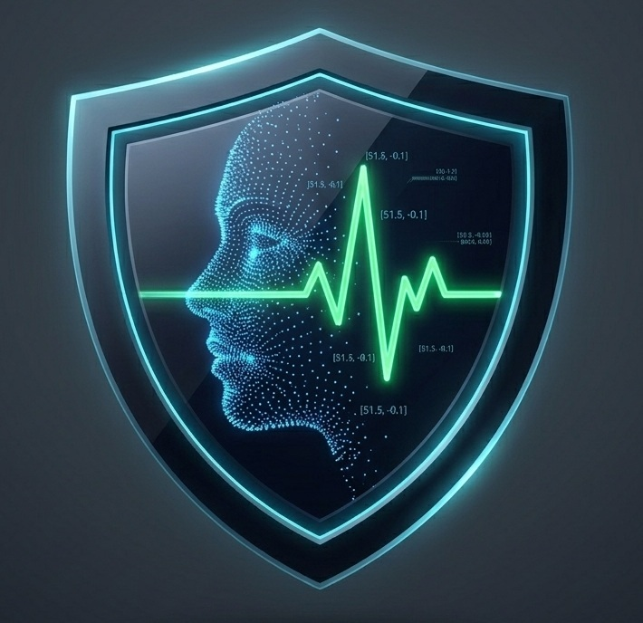
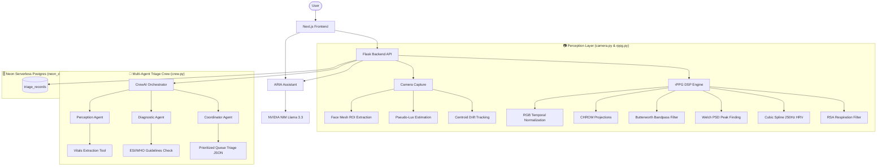

<div align="center">



# VITAL: Vision-Based Intelligent Triage and Autonomous Lifesign Analytics

### 🔬 Towards contactless health screening, serverless telemetry analytics, and AI-driven clinical coordination.

<p align="center">
  VITAL extracts physiological vitals from standard webcams via remote photoplethysmography (rPPG) and coordinates emergency triage through a CrewAI 3-Agent clinical swarm, a serverless Neon database, and the voice-enabled ARIA clinical assistant.
</p>

<br/>

<p align="center">
  
  
  
  
  
  
</p>

<p align="center">
  <a href="#-why-vital">Why VITAL</a> •
  <a href="#-features">Features</a> •
  <a href="#-architecture">Architecture</a> •
  <a href="#%EF%B8%8F-the-triage-crew-swarm">Triage Swarm</a> •
  <a href="#-dsp-signal-processing-pipeline">DSP Pipeline</a> •
  <a href="#-aria-assistant">ARIA Chatbot</a> •
  <a href="#-local-setup">Setup</a> •
  <a href="#-database-schema">Database Schema</a>
</p>

</div>

---

# 💡 Why VITAL?

Conventional triage relies on physical sensors and static **First-In, First-Out (FIFO)** queuing. In high-surge emergency departments, this causes delays that contribute to patient complications. 

VITAL addresses three major limitations identified in emergency medicine literature (such as the 30 papers in our `research/` directory):

* **Tabular Note Sparsity**: The system evaluates patients through polynomial vital cross-correlations (e.g., elevated heart rate paired with tachypnea to identify Compensated Shock), filling information gaps dynamically.
* **Clinical Alert Fatigue**: Instead of raw numbers, VITAL translates biometrics into structured, explainable classifications grounded in official **Emergency Severity Index (ESI)** and **WHO** guidelines.
* **Ineffective Static Queuing**: The system maintains a dynamic queue that automatically prioritizes high-acuity patients (especially those in active shock) at the top of the waitlist.

---

# ✨ Features

## 📷 Contactless rPPG Acquisition
* **Fitzpatrick Inclusivity**: mediaPipe 468-point Face Mesh isolates forehead landmarks `[10, 338, 297, 332, 284]` for illumination-blind blood volume pulse tracking.
* **Environmental Guards**: Automatically measures BT.601 luminance (lux) and centroid drift (motion delta) to flag sensor noise or target motion.
* **Haar Fallback**: Operates fully on Haar Cascades if MediaPipe components are missing.

## 🤖 Multi-Agent Triage Crew
* **Perception Specialist Agent**: Consolidates raw telemetry from live streams or video files.
* **Clinical Diagnostician Agent**: Analyzes physiological metrics, assigns ESI Acuity levels (1 to 5), and flags Compensated Shock.
* **Flow Coordinator Agent**: Assigns priority scores (1 to 100) and organizes queue sorting.

## 🎨 Modern UI/UX & Navigation Layout
* **Pitch-Black OLED Theme**: Pure `#000000` dark mode with high-contrast light mode toggle.
* **Left Sliding Navigation Sidebar**: Collapsible left sidebar (`w-64` expanded vs `w-16` icon-only view) with sharp vector icons for maximum workspace area.
* **Floating ARIA Cartoon Mascot**: Bottom-right floating AI mascot badge (`aria_mascot.png`) with animated hover speech bubble (`👋 Hii! I'm ARIA 🤖`), optical OCR document parsing, and voice controls.

## 💬 ARIA AI Chatbot
* **Context Ingestion**: Inherits read-only privileges to query Neon PostgreSQL patient records.
* **Multimodal OCR**: Allows uploading patient intake charts or clinical sheets, parsing the images directly.
* **Voice-Activated**: Integrates speech-to-text (STT) voice recognition and optional text-to-speech (TTS) playback in Next.js.

## 🗄️ Serverless Postgres Persistence
* All telemetry data, ESI levels, diagnostic summaries, and coordinator prioritizations are saved to a Neon database.
* The centralized queue loads records automatically sorted by urgency.

---

# 🏗 Architecture



---

# 🕵️ The Triage Crew Swarm

VITAL utilizes a sequential multi-agent task execution pipeline structured as follows:

| Agent | Role | Goal | Backstory |
| :--- | :--- | :--- | :--- |
| **Perception Agent** | Sensor Specialist | Extract heart rate, respiratory rate, and HRV metrics from video. | Expert in computer vision pipelines and rPPG signal analysis. |
| **Diagnostic Agent** | Clinical Diagnostician | Assess vitals to assign ESI levels and evaluate shock indexes. | Trained emergency diagnostician specializing in guideline-grounded triage. |
| **Coordinator Agent** | Flow Coordinator | Prioritize patients dynamically in the queue based on severity. | Flow manager dedicated to optimizing patient throughput and safety. |

---

# 🧬 DSP Signal Processing Pipeline

1. **Color Normalization**: Normalizes skin color channels to offset melanin levels:
   $$R_n(t) = \frac{R(t)}{\mu_R}, \quad G_n(t) = \frac{G(t)}{\mu_G}, \quad B_n(t) = \frac{B(t)}{\mu_B}$$
2. **Chrominance Projection**: Projects colors onto specular-free vectors:
   $$X = 3R_n - 2G_n, \quad Y = 1.5R_n + G_n - 1.5B_n$$
3. **Adaptive Scaling (CHROM)**: 
   $$Pulse(t) = X - \left(\frac{\sigma(X)}{\sigma(Y)}\right) \cdot Y$$
4. **Respiration RSA Filtering**: Extracts breathing rate via low-frequency bandpass (0.10 Hz – 0.50 Hz / 6–30 Breaths/min) and Welch periodogram spectral estimation.
5. **Cubic Spline Upsampling**: Upsamples the PPG signal to 250 Hz (4 ms quantization) for high-accuracy peak timing used to calculate RMSSD HRV.

---

# 💬 ARIA Assistant

**ARIA (Adaptive Real-time Intelligence for Acute-care)** is integrated directly into the dashboard.

* **Database Context**: Automatically receives active patient telemetry to answer operational queries.
* **OCR Support**: Users can upload document screenshots (base64 payload). ARIA runs multimodal document parsing to evaluate blood pressure, history, and intake info.
* **Strict Formatting**: Constrained to return standard capitalized headers and simple bullet points without markdown bold stars or hashtags, keeping TTS output clean.

---

# 🛠️ Local Setup

Make sure you have Python 3.9+ and Node.js v18+ installed.

### 1. Backend Server Setup
```bash
# Clone the repository
git clone https://github.com/MManoj-08/VITAL-Vision-Triage-Analytics-.git
cd VITAL-Vision-Triage-Analytics-

# Setup virtual environment
python -m venv venv
# Windows:
.\venv\Scripts\activate
# Linux/macOS:
source venv/bin/activate

# Install requirements
pip install -r requirements.txt
```

Create a `.env` file in the root folder:
```env
NVIDIA_API_KEY=your_nvidia_api_key
DATABASE_URL=your_neon_postgres_db_url
FLASK_DEBUG=false
```

Start the Flask server:
```bash
python app.py
```
*API Backend launches on `http://localhost:5002`*

### 2. Next.js Dashboard Setup
```bash
cd frontend
npm install
npm run dev
```
*SaaS Dashboard launches on `http://localhost:3000`*

---

# 🗃️ Database Schema

VITAL persists patient records to the `triage_records` table:

| Field | Type | Description |
| :--- | :--- | :--- |
| **id** | `VARCHAR(50) [PK]` | Unique patient record UUID string |
| **name** | `VARCHAR(100)` | Patient's full name |
| **timestamp** | `VARCHAR(30)` | Acquisition date-time string |
| **video_path** | `VARCHAR(255)` | Path to file, or 'live' |
| **esi_level** | `INTEGER` | Urgency classification (1 = critical, 5 = non-urgent) |
| **priority_score**| `INTEGER` | Emergency department triage priority (1 to 100) |
| **primary_diagnosis**| `VARCHAR(255)`| Extracted primary clinical assessment |
| **is_shock** | `BOOLEAN` | True if criteria for Compensated Shock is met |
| **triage_summary** | `TEXT` | Concise summary of triage logic |
| **agent_output** | `TEXT` | Full raw multi-agent diagnostic logs |
| **heart_rate** | `DOUBLE` | Computed resting BPM |
| **respiration** | `DOUBLE` | Computed breaths per minute |
| **hrv** | `DOUBLE` | Upsampled RMSSD value in milliseconds |
| **stress_index** | `DOUBLE` | Calculated Baevsky Stress Index score |

---

# ⚙️ CLI Utilities

* **Offline Vitals Extraction**:
  ```bash
  python scripts/analyze_video.py uploads/sample_face.mp4
  ```
* **MAE Accuracy Validation**:
  ```bash
  python scripts/validate_dataset.py
  ```
* **Standalone NLP Toolkit**:
  ```bash
  python scripts/open.py
  ```
* **CrewAI Swarm Verification**:
  ```bash
  python test_crew.py uploads/sample_face.mp4
  ```
